# Neural Network Architectural Patterns

This repository explores various neural network architectural patterns, showcasing different combinations of convolutional layers, attention mechanisms, multiscale feature learning, and other key components.

## Architecture Diagrams

### 1. Conv Layer → Attention → Multiscale
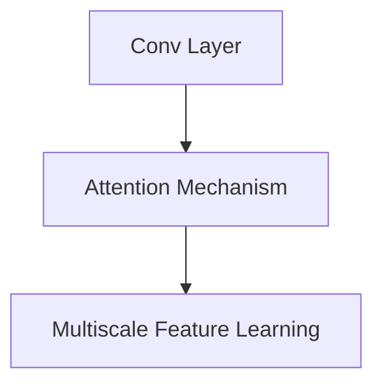
**Pattern**: Combines convolution, attention, and multiscale learning for enhanced feature extraction.

### 2. Conv Layer → Attention
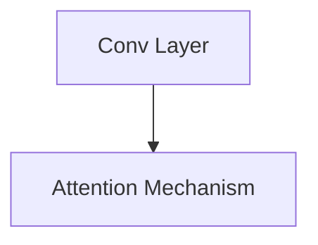
**Pattern**: Applies attention mechanism directly after convolutional layer to focus on important features.

### 3. Multiscale → Residual Connection

**Pattern**: Integrates multiscale features with residual connections to improve gradient flow.

### 4. Multiscale → Attention
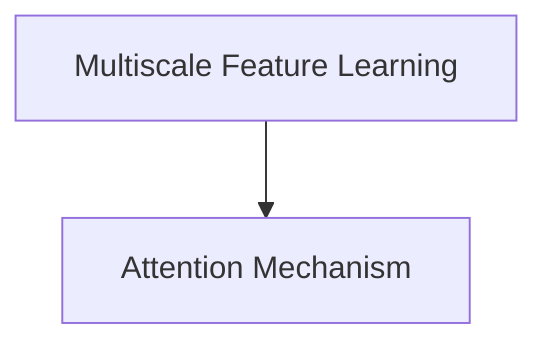
**Pattern**: Applies attention to multiscale features for selective feature emphasis.

### 5. Conv Layer → Multiscale
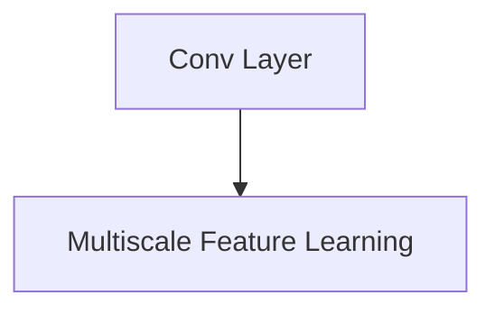
**Pattern**: Directly transforms convolutional features into multiscale representations.

### 6. Conv → Global Avg Pooling → Dilated Convolution
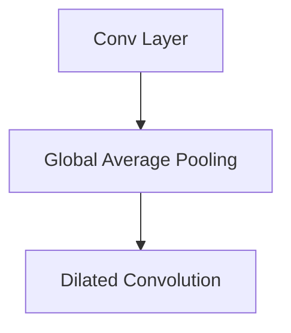
**Pattern**: Reduces spatial dimensions with global pooling before applying dilated convolution.

### 7. Conv → Global Avg Pooling → Attention
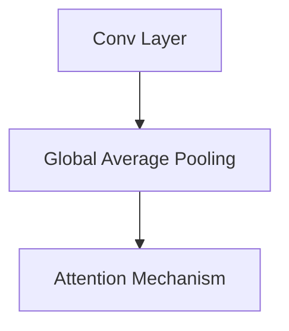
**Pattern**: Applies global pooling to reduce dimensionality before attention mechanism.

### 8. Multiscale → Attention → Residual
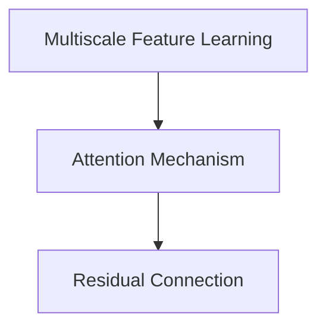
**Pattern**: Combines multiscale learning, attention, and residual connections.

### 9. Dilated Conv → Multiscale → Residual → Global Avg Pooling
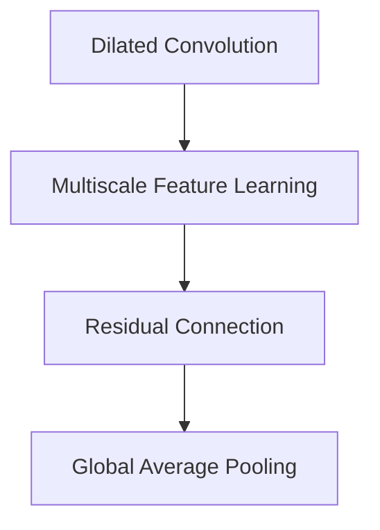
**Pattern**: Complex architecture with expanded receptive field and feature refinement.

### 10. Conv → Global Avg Pooling → Multiscale → Attention
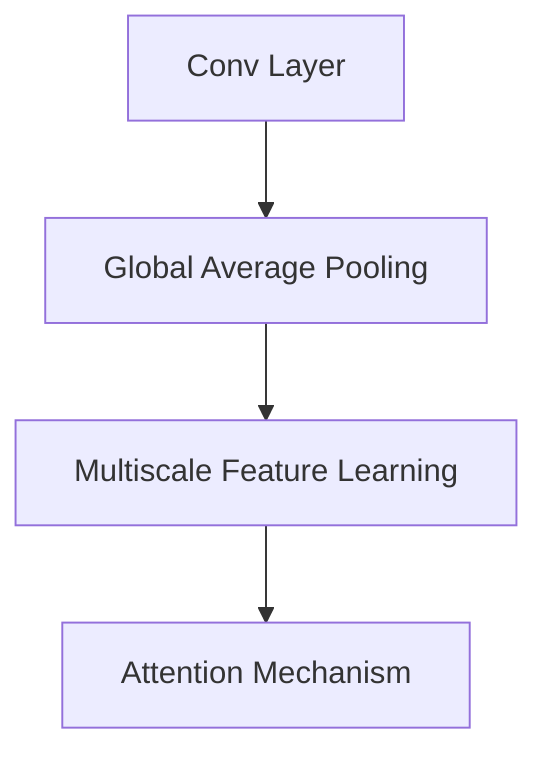
**Pattern**: Progressively refines features through pooling, multiscale, and attention stages.

### 11. Conv → Global Avg Pooling → Attention → Residual
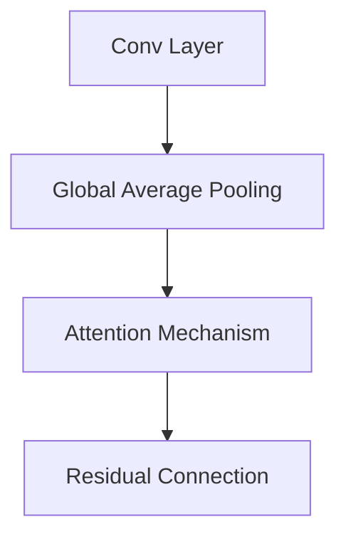
**Pattern**: Combines pooling, attention, and residual learning.

### 12. Multiscale → Global Avg Pooling → Residual → Dilated Conv
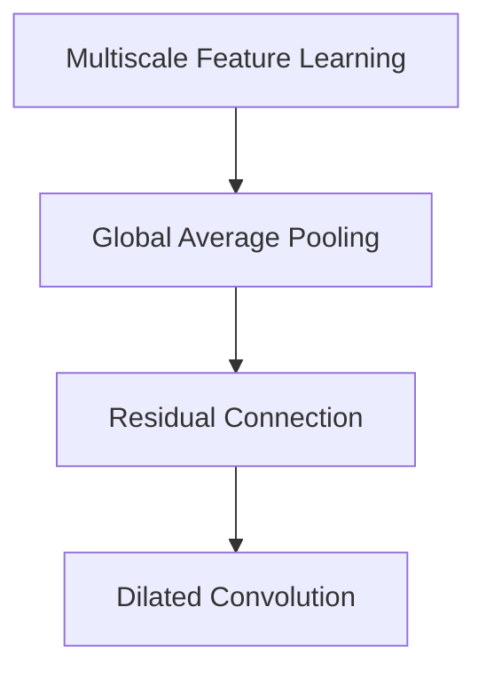
**Pattern**: Advanced feature processing with multiple transformation stages.

### 13. Attention → Multiscale → Residual → Global Avg Pooling
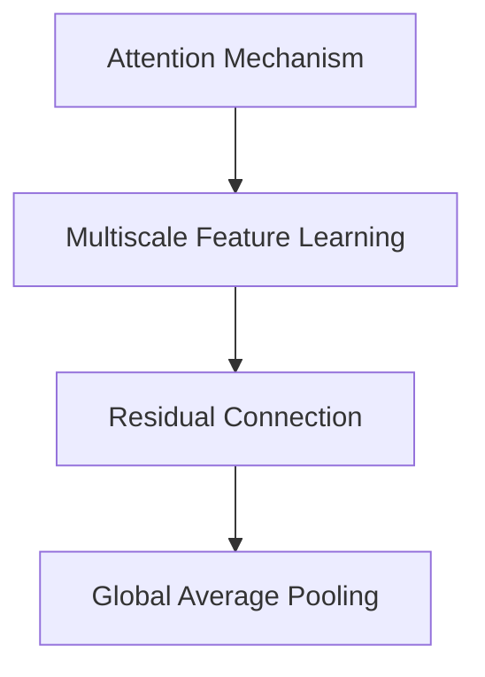
**Pattern**: Attention-driven multiscale feature learning with residual connections.

## Key Components

- **Convolutional Layer**: Extracts local features
- **Attention Mechanism**: Focuses on important feature regions
- **Multiscale Feature Learning**: Captures features at multiple scales
- **Residual Connection**: Improves gradient flow
- **Global Average Pooling**: Reduces spatial dimensions
- **Dilated Convolution**: Increases receptive field

## Usage

Explore these architectural patterns in your deep learning projects. Each pattern offers unique advantages for different tasks.
